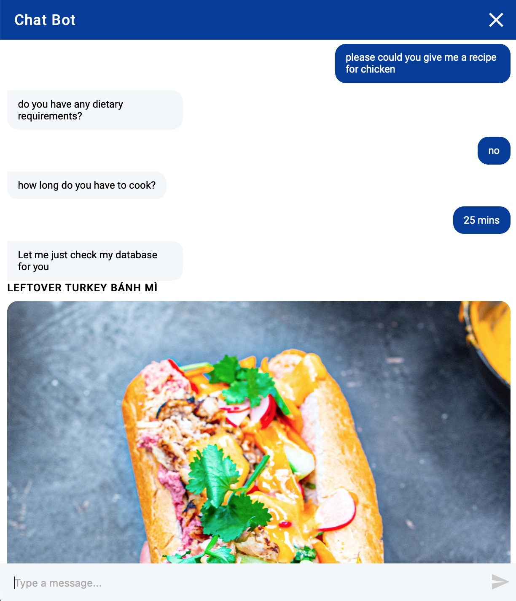

# recipe-chatbot

## Project Overview

This project uses the Rasa open source chatbot framework to create a bot that can find recipes according to users preferences, dietary requirements and time to cook. I have initially used recipes from [mob kitchen](http://www.mobkitchen.co.uk) but I plan to add some more as I develop the project.

## Technologies used

- [Rasa](https://github.com/RasaHQ/rasa)
- Selenium to scrape the web
- Sqlite as a database for scraped recipes

## Project structure

The project has two main parts:

- [Bot](./bot)
- [Web scraping](./scraper)

### Scrapping component

1. I use the [`mob_scraper.py`](./scraper/mob_scraper.py) script to scrape the recipes from the web which are then saved in a csv file
2. After scraping I use [`csv_to_sqlite.py`](./scraper/csv_to_sqlite.py) to clean the data and save it to an sqlite database. I use [the duckling entity extractor](https://github.com/facebook/duckling) here to extract pieces of information from the scrapped text (e.g. to get a normalized duration of 3600s from 'Preparation time: one hour')

### Bot component

1. The bot is trained using the data [here](./bot/data) which informs it of both _intents_ and _entities_
2. The bot is linked to the database through the [`actions.py`](./bot/actions.py) which tells it what information is needed for a database search
3. The [`actions.py`](./bot/actions.py) communicates to the database through the [`db_fetch.py`](./bot/db_fetch.py) file (I aim to add a recommendation engine here to learn from users previous preferences)

## Interface

I am currently experimenting with a [webchat interface](https://github.com/botfront/rasa-webchat) which I plan to include on my own [website](edward-rees.com).

