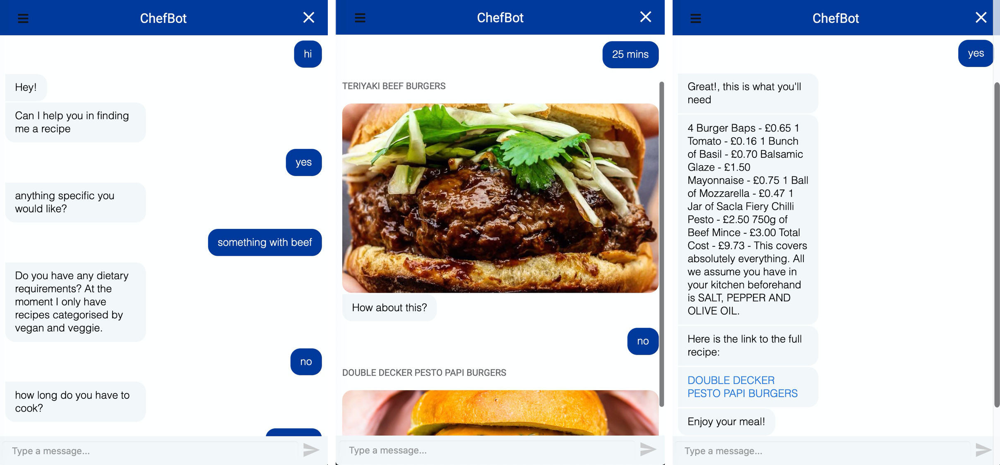

# ChefBot

## Project Overview

This project uses the Rasa open source chatbot framework to create a bot that can find recipes according to users preferences, dietary requirements and time to cook. I have initially used recipes from [mob kitchen](http://www.mobkitchen.co.uk) but I plan to add some more as I develop the project.

### Technologies used

- [Rasa](https://github.com/RasaHQ/rasa), an open source framework in Python for developing chat bots
- Selenium to scrape the web
- Sqlite as a database for scraped recipes

## Installation

To install first clone this repository.
```bash
git clone https://github.com/erees1/chefbot
cd chefbot
```

### Requirements
* `python 3.7.4`
* `rasa 1.10.23`

This project has fairly strict dependencies. The code below shows how to setup a virtual environment and installs the dependencies.

```bash
# Make venv
make env

# Activate
source venv/bin/activate

# Install dependencies from requirements
make deps
```

## Usage

There are a couple of ways to run the chefbot depending on how you want to interact with it.

```bash
# Run in shell
python chefbot.py shell

# Run in local browser
python chefbot.py local

# Run with ngrok and update github pages site
python chefbot.py full
```

## Project structure

The project has two main parts:

- [Bot](./bot)
- [Web scraping](./scraper)

### Scrapping component

1. I use the [`mob_scraper.py`](./scraper/mob_scraper.py) script to scrape the recipes from the web which are then saved in a csv file
2. After scraping I use [`csv_to_sqlite.py`](./scraper/csv_to_sqlite.py) to clean the data and save it to an sqlite database. I use [the duckling entity extractor](https://github.com/facebook/duckling) here to extract pieces of information from the scrapped text (e.g. to get a normalized duration of 3600s from 'Preparation time: one hour')

### Bot component

1. The bot is trained using the data [here](./bot/data) which informs it of both _intents_ and _entities_
2. The bot is linked to the database through the [`actions.py`](./bot/src/actions.py) which tells it what information is needed for a database search
3. The [`actions.py`](./bot/src/actions.py) communicates to the database through the [`db_fetch.py`](./bot/src/db_fetch.py) file (I aim to add a recommendation engine here to learn from users previous preferences)

## Web Interface

I have integrated a [webchat interface](https://github.com/botfront/rasa-webchat) on my [website](https://edward-rees.com/chefbot). As the bot / rasa servers run on my computer it is not live all the time but if it is running you will be able to chat with the bot. A local version of interface can be started by running `python chefbot.py local`

My website runs on github pages and communicates with the bot using [ngrok](https://ngrok.com). The ngrok url changes each time you run it (at least on the free version) so the [`update_website.py`](./update_website.py) script checks what the public ngrok url is and then updates the html on the chefbot page of the website and pushes the changes to GitHub.

### Example Conversation


